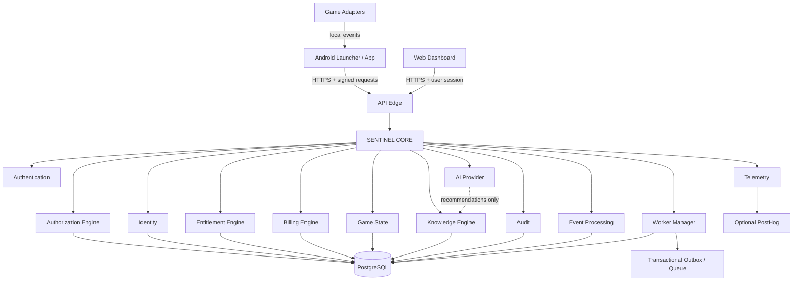
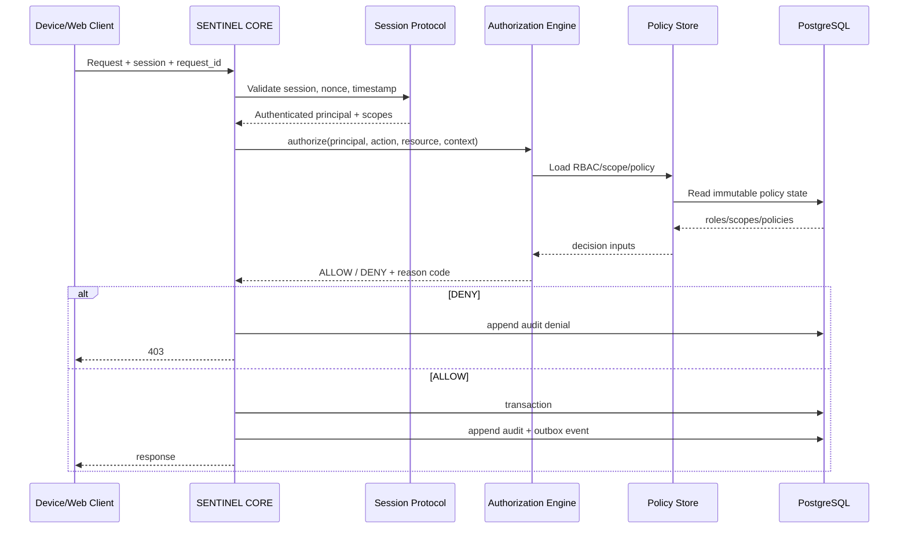
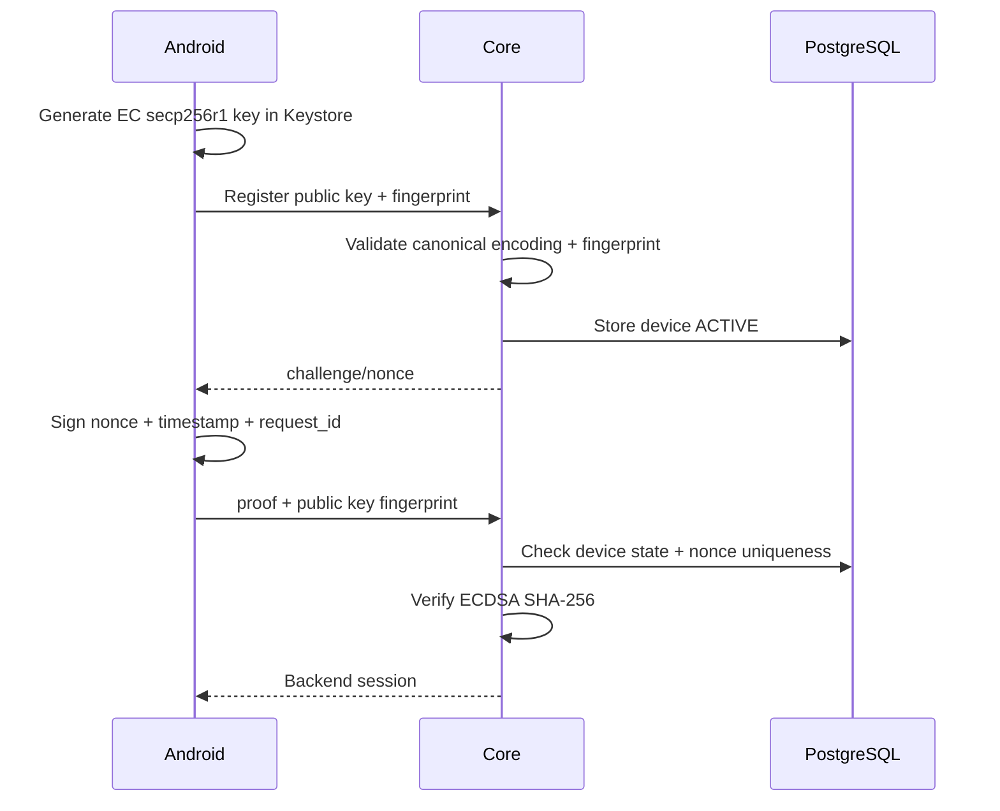
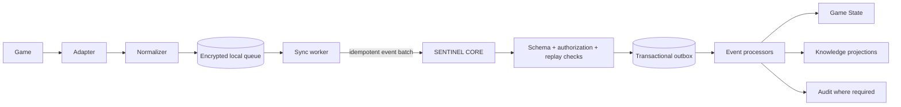
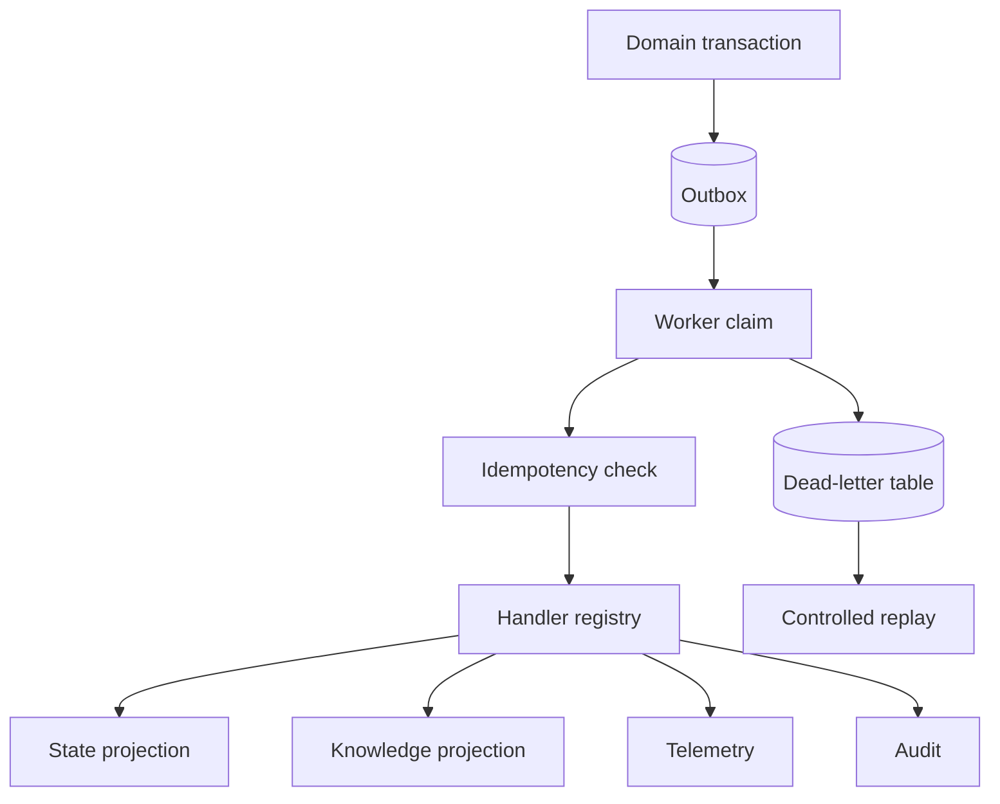
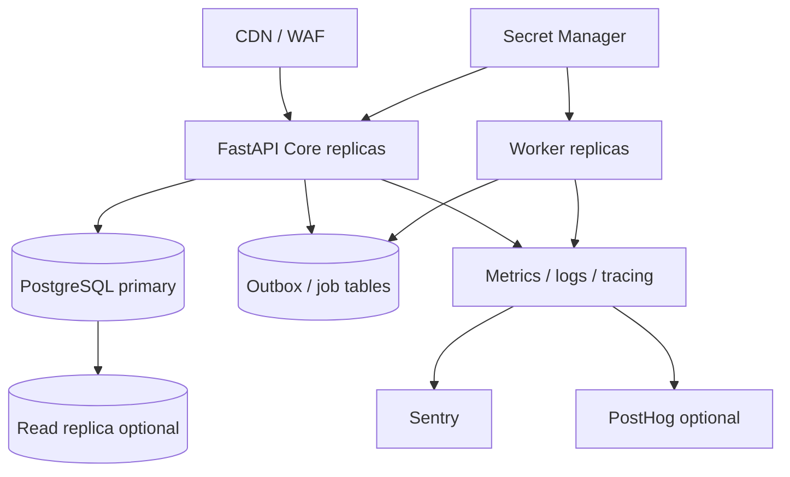

# SENTINEL — Full-Stack Architecture v4

## 1. Mission and invariants

SENTINEL is a security-first modular monolith with SENTINEL CORE as the single source of truth. The system separates Identity, Authentication, Authorization, Entitlement, Billing, Game State, Knowledge, Telemetry and AI. All privileged decisions are server-side. Default is deny. Local-first applies to game adapters and offline state, never to authorization.

### Hard invariants

1. No client is trusted to authorize an operation.
2. Authentication proves possession; authorization decides access.
3. Entitlement is independent from billing provider implementation.
4. Game adapters emit facts/events; they do not mutate authoritative server state directly.
5. Audit events are append-only and security-sensitive.
6. Replay protection requires a server-issued nonce/challenge and a unique request id.
7. Device private keys never leave Android Keystore.
8. AI emits fact/inference/recommendation with confidence and provenance; it never becomes an authority.
9. Offline queues are bounded, idempotent and replay-safe.
10. Production releases require build, security, integration and artifact verification gates.

## 2. Logical architecture

## 3. Authorization flow

## 4. Device identity

Android uses Android Keystore EC P-256 (`secp256r1`) signing keys. The server stores the public key and a SHA-256 fingerprint. A registration challenge binds the key to the account. Authentication signs a server nonce plus canonical request metadata.

Key lifecycle: `GENERATED -> ACTIVE -> ROTATING -> REVOKED`. Revocation is terminal for a key version. Rotation creates a new key and preserves the device identity while invalidating the old proof key after a grace period.

## 5. Game adapter and event model

Adapters are not trusted writers. Every event has `event_id`, `device_id`, `occurred_at`, `sequence`, `schema_version`, `type`, `payload`, and a client-generated idempotency key. Server ordering is authoritative.

## 6. Event processing

Workers use lease-based claiming, exponential backoff, bounded retries and a dead-letter state. No event is acknowledged before the durable transaction completes.

## 7. Module boundaries

| Module | Owns | Must not own |
|---|---|---|
| Identity | users, principals, device records | permissions decisions |
| Authentication | proof verification, session issuance | business entitlement |
| Authorization | RBAC, scopes, policies, decisions | credentials |
| Entitlement | feature/product grants | payment transport |
| Billing | provider/customer/subscription state | access decisions |
| Game State | authoritative character/game projections | identity |
| Knowledge | facts, provenance, confidence, recommendations | authorization |
| Event Processing | event validation, dispatch, projections | direct UI concerns |
| Audit | immutable security/business audit trail | mutable application state |
| Telemetry | operational/product metrics | security truth |
| AI | inference/recommendation generation | commands/privilege |

## 8. PostgreSQL model

Core tables:

- `users(id, external_subject, status, created_at, updated_at)`
- `user_roles(user_id, role_id)`
- `roles(id, name, version)`
- `role_permissions(role_id, permission_id)`
- `permissions(id, action, resource)`
- `scopes(id, name)`
- `user_scopes(user_id, scope_id)`
- `policies(id, effect, action, resource_pattern, condition_json, version, active)`
- `devices(id, user_id, state, platform, public_key_der, fingerprint_sha256, key_version, created_at, last_seen_at, revoked_at)`
- `device_challenges(id, device_id, nonce_hash, expires_at, consumed_at)`
- `sessions(id, user_id, device_id, session_hash, scopes_json, issued_at, expires_at, revoked_at)`
- `entitlements(id, user_id, product_code, source, status, starts_at, ends_at, metadata_json)`
- `billing_customers(id, user_id, provider, provider_customer_id, status)`
- `billing_subscriptions(id, customer_id, provider_subscription_id, product_code, status, current_period_end)`
- `characters(id, user_id, game_id, external_id, name, version, state_json, updated_at)`
- `knowledge_items(id, namespace, subject, predicate, object_json, kind, confidence, provenance_json, version)`
- `game_events(id, event_id, device_id, user_id, type, schema_version, occurred_at, sequence, payload_json, received_at)`
- `outbox_events(id, aggregate_type, aggregate_id, event_type, payload_json, status, attempts, available_at, locked_until)`
- `audit_events(id, actor_user_id, actor_device_id, action, resource_type, resource_id, decision, reason_code, metadata_json, created_at)`
- `idempotency_keys(key, actor_id, request_hash, response_json, created_at, expires_at)`
- `worker_jobs(id, kind, payload_json, status, attempts, available_at, locked_until, last_error)`

### Required indexes

- unique `users.external_subject`
- unique `devices.fingerprint_sha256`
- unique `device_challenges.nonce_hash`
- unique `sessions.session_hash`
- unique `game_events.event_id`
- `(game_events.device_id, sequence)` unique
- `(outbox_events.status, available_at)`
- `(worker_jobs.status, available_at)`
- `(audit_events.actor_user_id, created_at desc)`
- `(audit_events.resource_type, resource_id, created_at desc)`
- `(entitlements.user_id, product_code, status)`
- `(characters.user_id, game_id, external_id)` unique

RLS can be used as a defense-in-depth boundary for user-scoped projections, but application authorization remains mandatory.

## 9. API contract

All endpoints are versioned under `/v1`. JSON uses RFC 3339 timestamps. Errors use `{code,message,request_id}`. Mutating endpoints require an idempotency key. Sensitive endpoints require an authenticated session and explicit authorization check.

### Device
- `POST /v1/devices/register`
- `POST /v1/devices/{device_id}/challenge`
- `POST /v1/devices/{device_id}/prove`
- `POST /v1/devices/{device_id}/rotate`
- `POST /v1/devices/{device_id}/revoke`
- `GET /v1/devices`

### Session
- `POST /v1/sessions`
- `POST /v1/sessions/refresh`
- `POST /v1/sessions/revoke`

### Authorization
- `POST /v1/authorize`

### Game state
- `GET /v1/characters`
- `GET /v1/characters/{character_id}`
- `POST /v1/events:batch`

### Entitlement/Billing
- `GET /v1/entitlements`
- `GET /v1/billing/subscription`
- `POST /v1/billing/webhooks/{provider}`

### Knowledge/AI
- `GET /v1/knowledge/query`
- `POST /v1/recommendations`

### Audit
- `GET /v1/audit`

## 10. Security model

- TLS required in production; HSTS at edge.
- Secrets only through runtime secret manager/environment injection; never source control.
- Passwords, if introduced, use an established password hashing scheme; no custom crypto.
- Device proofs use ECDSA P-256/SHA-256 and canonical byte serialization.
- Session identifiers are random opaque values stored hashed server-side.
- Nonces are random, short-lived, one-time consumables.
- Clock skew is bounded; replay is denied outside the acceptance window.
- Rate limits are applied to registration, proof, login and webhook surfaces.
- Webhooks require provider signature verification and idempotency.
- Audit records are append-only from application roles.
- AI has no authority to grant access, alter billing, revoke devices or execute game actions.

## 11. Deployment topology

The first deployment remains a modular monolith plus worker process. Horizontal scaling is allowed without splitting domain modules into network services prematurely.

## 12. Acceptance gates

`FAIL -> root cause -> FIX -> regression -> PASS -> ACCEPTED`.

A component is not considered implemented until its build, unit tests, integration tests, security tests and relevant artifact validation pass. The repository README's acceptance rule remains authoritative for ALPHA-0. fileciteturn143file0L2-L2
