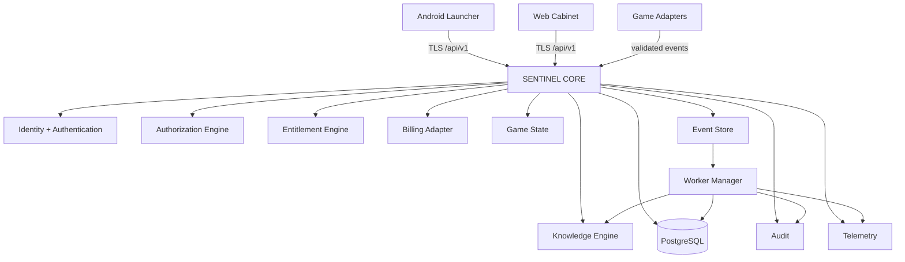
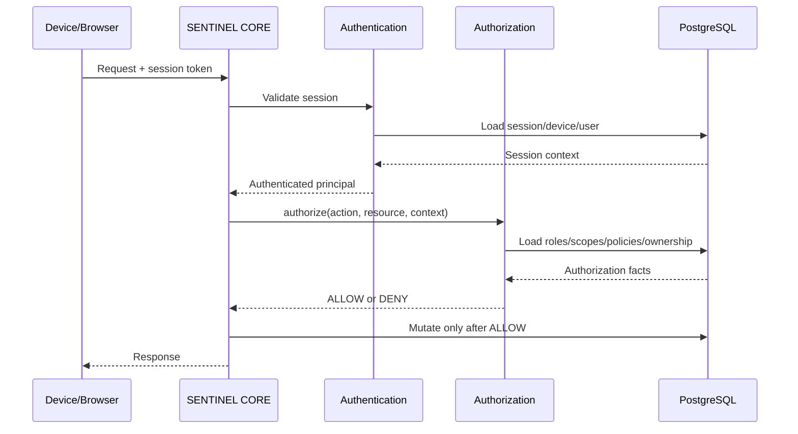
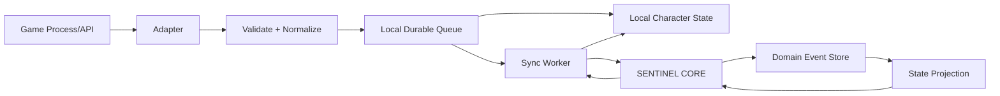
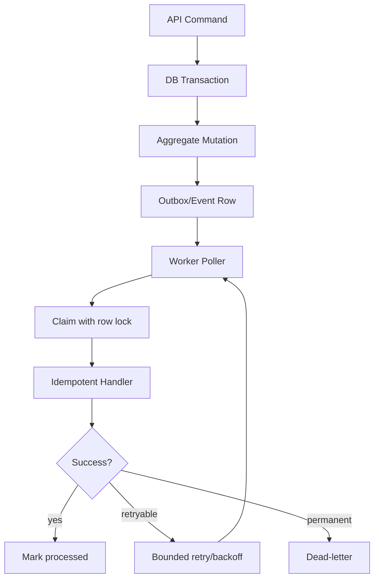

# SENTINEL Diagrams

## Overall architecture



## Authorization flow



## Device identity

```mermaid
sequenceDiagram
    participant A as Android
    participant K as Android Keystore
    participant S as SENTINEL CORE
    participant DB as PostgreSQL

    A->>K: Generate EC P-256 key
    K-->>A: Public key; private key stays hardware/keystore-backed
    A->>S: Register public key + fingerprint
    S->>DB: Store device + key state ACTIVE
    A->>S: Request challenge
    S->>DB: Create one-time nonce
    S-->>A: challenge + expiry
    A->>K: Sign challenge
    K-->>A: ECDSA signature
    A->>S: challenge + signature + device id
    S->>DB: Atomically consume challenge
    S->>K: Verify public key signature
    S->>DB: Issue backend session
    S-->>A: session
```

## Game adapter / local-first flow



## Event processing


