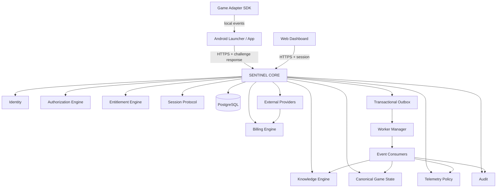
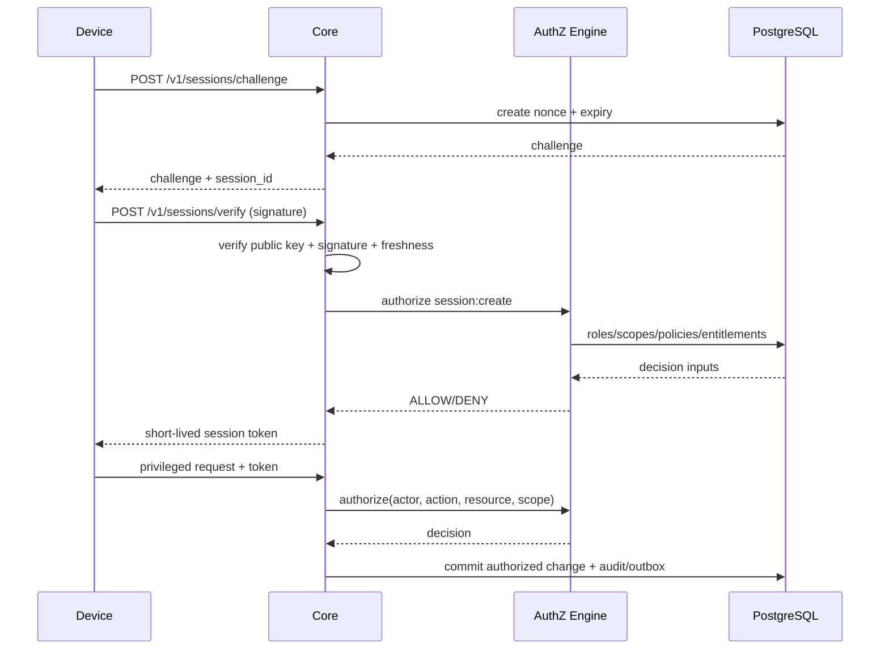
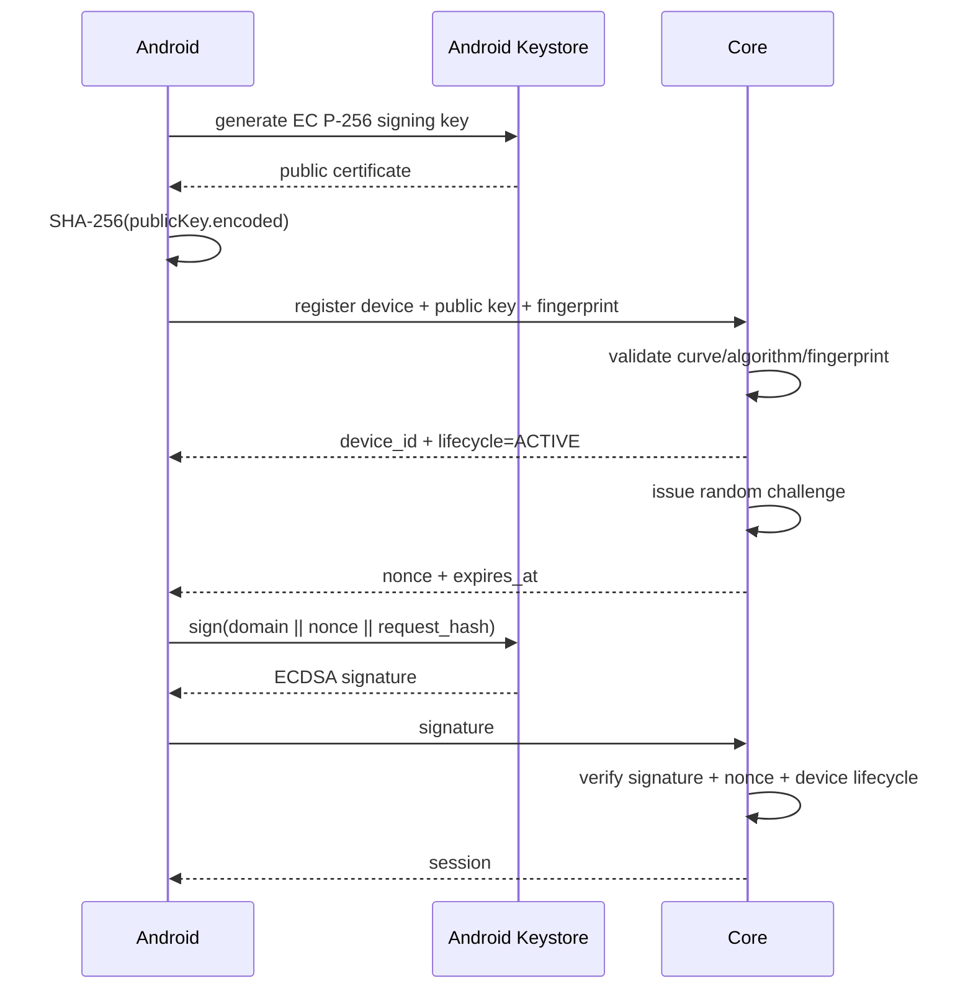
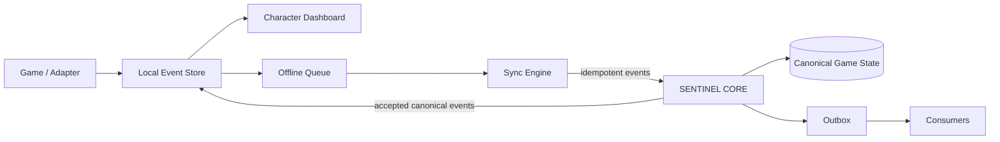
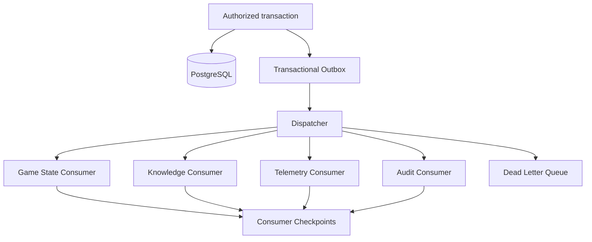

# SENTINEL Full-Stack Architecture v4

## 1. System boundaries

SENTINEL CORE is the single source of truth for identity, authorization, entitlements, billing state, canonical game state, knowledge provenance, telemetry policy, and audit records.

Clients are untrusted. Android is local-first for gameplay adapters and offline UX, but server authorization is authoritative. The web client is a presentation client and never receives authorization to bypass Core policy.

## 2. Modules

- Identity: account and device identity records.
- Authentication: credential/session verification.
- Authorization: RBAC + scope + policy, default deny.
- Entitlement: derived access rights from grants/subscriptions.
- Billing: provider-neutral billing state and immutable ledger references.
- Game State: canonical character/game state and versioning.
- Knowledge: facts, inferences, recommendations, provenance and confidence.
- Telemetry: allowlisted events, privacy controls, rate limits.
- Eventing: transactional outbox, idempotency, consumer checkpoints.
- Workers: bounded background jobs with retry/backoff/dead-letter semantics.
- Audit: append-only security-sensitive trail.
- Session Protocol: short-lived server sessions bound to device identity and challenge-response.

## 3. Trust model

1. Network is hostile.
2. Client state is advisory and may be replayed or modified.
3. Server validates every privileged operation.
4. Every write has an actor, scope and idempotency key where applicable.
5. Security-sensitive records are append-only or versioned.
6. Database access is least privilege; tenant/user isolation uses PostgreSQL RLS where applicable.

## 4. Runtime topology

## 5. Authorization flow

## 6. Device identity

Android Keystore keeps private key material non-exportable and can bind keys to secure hardware; hardware-backed status and attestation must be treated as device properties, not as a replacement for server-side authorization. citeturn1search0turn1search1

## 7. Game adapter

## 8. Event system

Exactly-once side effects are implemented as at-least-once delivery plus idempotent consumers. The outbox record and domain mutation are committed in one database transaction.

## 9. API layers

- `/v1/sessions/*`: challenge-response and session lifecycle.
- `/v1/devices/*`: device registration, rotation, revocation.
- `/v1/me/*`: user-scoped dashboard data.
- `/v1/characters/*`: canonical game state.
- `/v1/knowledge/*`: fact/inference/recommendation retrieval.
- `/v1/events/*`: authenticated client event ingestion.
- `/v1/billing/*`: provider-neutral billing state.
- `/v1/audit/*`: privileged audit views.
- `/health/live`, `/health/ready`: operational health only; no secrets.

## 10. Security invariants

- Missing authorization context => deny.
- Unknown action => deny.
- Unknown scope => deny.
- Revoked device => deny.
- Expired nonce => deny.
- Reused nonce => deny.
- Session expired/revoked => deny.
- Client-provided role/entitlement/billing fields are ignored.
- Audit records cannot be modified through public API.
- Sensitive telemetry is opt-in/allowlisted and minimized.
