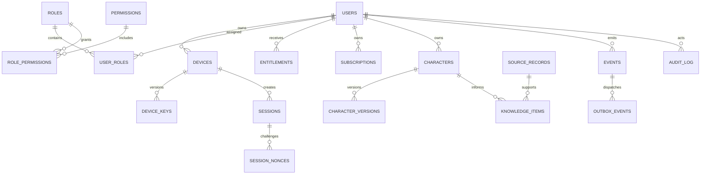

# SENTINEL PostgreSQL Data Model v1

PostgreSQL 17+ is the target. UUIDs are generated server-side. Timestamps are UTC `timestamptz`.

## Core tables

| Table | Purpose | Key indexes |
|---|---|---|
| users | identity/account | email unique, status |
| roles | RBAC roles | name unique |
| permissions | action catalog | action unique |
| role_permissions | role -> permission | role/action unique |
| user_roles | user -> role | user/role unique |
| scopes | authorization scope definitions | owner/type |
| policies | policy rules | action/scope |
| devices | device identity | user/status/fingerprint unique |
| device_keys | key lifecycle versions | device/version unique |
| sessions | server sessions | token hash, device/status |
| session_nonces | challenge replay protection | nonce unique, expires_at |
| entitlements | access grants | user/product/status |
| subscriptions | billing state | user/provider reference |
| billing_ledger | immutable billing references | provider event id unique |
| characters | canonical game state | user/game |
| character_versions | optimistic concurrency | character/version unique |
| knowledge_items | facts/inferences/recommendations | character/kind |
| source_records | knowledge provenance | source hash unique |
| events | accepted domain events | event_id unique, aggregate |
| outbox_events | transactional event delivery | status/next_attempt_at |
| consumer_checkpoints | consumer offsets | consumer/event unique |
| dead_letters | failed events | status/created_at |
| audit_log | append-only security audit | actor/created_at, request_id |
| idempotency_keys | request dedupe | actor/key unique |
| telemetry_events | allowlisted telemetry | actor/event/created_at |

## Relationships

## RLS strategy

Tables containing user-owned data are RLS-enabled. The application sets a transaction-local actor UUID and scopes access through policies. PostgreSQL uses default-deny behavior when RLS is enabled without a matching policy, which is aligned with SENTINEL's security invariant. citeturn0search2turn0search7

Privileged migrations use a dedicated migration role. Runtime roles do not own application tables and do not have `BYPASSRLS`.
